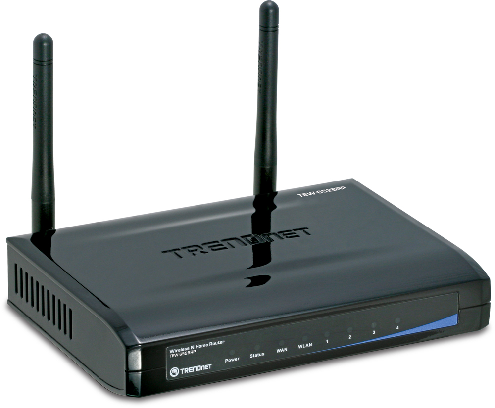

# 1. Information gathering and reconnaissance
Name: N300 Wireless Home Router  
Model: TEW-652BRP (Version V1.0R)  
Link: [trendnet.com](https://www.trendnet.com/langen/support/support-detail.asp?prod=150_TEW-652BRP#specifications)  
Datasheets: [datasheets](./datasheets)  
FCC ID: [XU8TEW652BRPV3](https://fccid.io/XU8TEW652BRPV3)

Specifications:
- System-on-a-Chip (SoC): Realtek RTL8197D  
- Flash memory: 128 Мб (MXIC MX25L12845EMI-10G)  
- Synchronous DRAM (SDRAM) memory: 64 Мб (EtronTech EM6AB160TSD-5G)  
- Wi-Fi module: Realtek RTL8192CE (802.11b, 802.11g, draft 802.11n)  

# 2. Obtaining firmware
At the moment the firmware is downloaded from the official site. [trendnet.com](https://www.trendnet.com/langen/support/support-detail.asp?prod=150_TEW-652BRP#specifications)  

# 3. Analyzing firmware
Now it's time to explore aspects of the file to identify its characteristics.

```bash
% file TEW652BRPR1_FW200B0045.bin 
TEW652BRPR1_FW200B0045.bin: data
```

```bash
% binwalk TEW652BRPR1_FW200B0045.bin 

DECIMAL       HEXADECIMAL     DESCRIPTION
--------------------------------------------------------------------------------
8208          0x2010          LZMA compressed data, properties: 0x5D, dictionary size: 8388608 bytes, uncompressed size: 2834566 bytes
917520        0xE0010         Squashfs filesystem, big endian, version 2.1, size: 1789312 bytes, 372 inodes, blocksize: 65536 bytes, created: 2011-06-13 09:10:03
```

```bash
% hexdump -C TEW652BRPR1_FW200B0045.bin | head
00000000  63 72 36 62 80 50 00 00  00 01 00 00 00 0c 84 02  |cr6b.P..........|
00000010  00 00 00 00 00 00 80 21  40 90 60 00 00 00 00 00  |.......!@.`.....|
00000020  00 00 00 00 00 00 00 00  3c 10 80 5d 26 10 84 00  |........<..]&...|
00000030  3c 11 80 5d 26 31 09 8c  02 00 40 21 ad 00 00 00  |<..]&1....@!....|
00000040  21 08 00 04 15 11 ff fd  00 00 00 00 02 20 40 21  |!............ @!|
00000050  21 08 10 00 01 00 e8 21  08 14 00 98 01 00 20 21  |!......!...... !|
00000060  00 00 00 00 08 14 00 15  00 00 00 00 00 00 00 00  |................|
00000070  00 80 40 21 24 04 00 00  24 05 00 00 01 00 00 08  |..@!$...$.......|
00000080  24 06 00 00 00 00 00 00  3c 09 bd 01 35 29 01 0c  |$.......<...5)..|
00000090  8d 28 00 00 3c 09 f0 00  01 09 40 24 00 08 47 02  |.(..<.....@$..G.|
```

```bash
% fdisk -lu TEW652BRPR1_FW200B0045.bin
Disk TEW652BRPR1_FW200B0045.bin: 2,81 MiB, 2949120 bytes, 5760 sectors
Units: sectors of 1 * 512 = 512 bytes
Sector size (logical/physical): 512 bytes / 512 bytes
I/O size (minimum/optimal): 512 bytes / 512 bytes
```

```bash
% binwalk -E TEW652BRPR1_FW200B0045.bin --save

DECIMAL       HEXADECIMAL     ENTROPY
--------------------------------------------------------------------------------
0             0x0             Falling entropy edge (0.610608)
8192          0x2000          Rising entropy edge (0.985291)
819200        0xC8000         Falling entropy edge (0.171630)
917504        0xE0000         Rising entropy edge (0.982116)
2703360       0x294000        Falling entropy edge (0.720034)
```
Low entropy = Not likely to be encrypted  
High entropy = Its likely encrypted (or compressed in some way).  

# 4. Extracting the filesystem
Run the following binwalk command carving the Squashfs filesystem:
```bash
$ binwalk -eM TEW652BRPR1_FW200B0045.bin
```
We got an error:
```
WARNING: Extractor.execute failed to run external extractor 'sasquatch -p 1 -le -d 'squashfs-root' '%e'': [Errno 2] No such file or directory: 'sasquatch', 'sasquatch -p 1 -le -d 'squashfs-root' '%e'' might not be installed correctly
```

To fix this we need to install this [patch](https://github.com/threadexio/sasquatch) and voila, we got Squashfs filesystem
```bash
% ls squashfs-root
total 64
drwxrwxrwx 16 user user 4096 ноя  8 13:30 .
drwxr-xr-x  4 user user 4096 ноя  8 13:28 ..
drwxr-xr-x  2 user user 4096 июн 13  2011 bin
drwxrwxrwx  3 user user 4096 июн 13  2011 dev
-rwxr-xr-x  1 user user    0 янв 25  2007 .dummy
drwxr-xr-x  3 user user 4096 июн 13  2011 etc
-rw-r--r--  1 user user    0 ноя  8 13:30 fs.out
drwxr-xr-x  4 user user 4096 июн 13  2011 lib
lrwxrwxrwx  1 user user   11 ноя  8 13:28 linuxrc -> bin/busybox
drwxrwxrwx  2 user user 4096 янв 25  2007 lost+found
drwxr-xr-x  2 user user 4096 июн 13  2011 mnt
drwxrwxrwx  2 user user 4096 янв 25  2007 proc
drwxrwxrwx  2 user user 4096 янв 25  2007 root
drwxr-xr-x  2 user user 4096 июн 13  2011 sbin
drwxr-xr-x  3 user user 4096 июн 13  2011 share
drwxrwxrwx  2 user user 4096 янв 25  2007 tmp
drwxrwxrwx  4 user user 4096 июн 13  2011 usr
lrwxrwxrwx  1 user user    6 ноя  8 13:28 var -> ./tmp/
drwxr-xr-x  2 user user 4096 июн 13  2011 wps_xml
drwxr-xr-x  2 user user 4096 июн 13  2011 www
```

# 5. Analyzing filesystem contents
## Firmwalker
Time to statically analyze the file system with Firmwalker.
Firmwalker uses information in the "/data/” directory for parsing rules. A custom fork modified by Aaron Guzman with additional checks can be found on GitHub at https://github.com/scriptingxss/firmwalker.

[Firmwalker results](./reports/firmwalker)

## EMBA - Embedded Analyzer
[EMBA](https://github.com/e-m-b-a/emba) is designed as a core firmware analysis tool for penetration testers. It supports the full security analysis process, starting with the firmware extraction, static analysis and dynamic analysis via emulation to generating a web-based report for further analysis. Launched with a single command, EMBA automatically discovers potential weak spots and vulnerabilities in the firmware under test, such as insecure binaries, old and outdated software components, potentially vulnerable scripts or hard-coded passwords.

Further results are available in the log directory and can be analyzed on the command line or via the [web-browser](./reports/EMBA/html-report/index.html)

# 6. Emulating firmware
### TODO

# 7. Dynamic analysis
### TODO

# 8. Runtime analysis
 ### TODO

# 9. Binary Exploitation
### TODO
